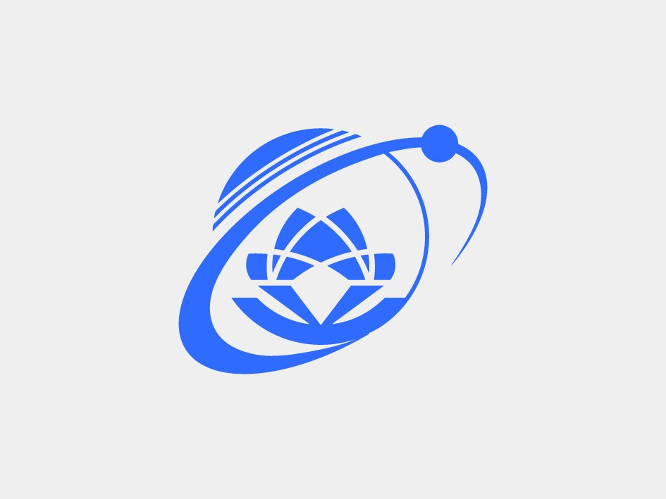

  

  

---

## What I Build

- $\color{#3DDC84}\textbf{Mobile Apps}$ — Native Android with Kotlin and cross-platform apps with React Native.
- $\color{#06B6D4}\textbf{Web Products}$ — Full-stack applications with React, TypeScript, and Node.js.
- $\color{#F5A623}\textbf{Backend Services}$ — REST APIs, server-side logic, and production-ready integrations.
- $\color{#FF6B9D}\textbf{Modern UI}$ — Responsive, clean, and user-friendly interfaces.
- $\color{#7F5AF0}\textbf{AI Workflows}$ — Faster iteration, better code review, and cleaner implementation.

## AI Toolkit

I use AI tools as part of my daily engineering workflow for planning, coding, debugging, refactoring, and documentation.

## Tech Stack

### Languages & Frameworks

### Tools

## Experience

>  🟢 **Mobile Developer** — [HDBank](https://hdbank.com.vn/)
>  Feb 2026 – Present
>
>  ⚪ **Mobile Developer** — [MoMo Wallet (M_Service)](https://momo.vn/)
>  2021 – Jan 2026

## Education

 **University of Information Technology (UIT)**
 2019 - 2024

<!--
## GitHub Activity

  

  

-->

## Connect

  
   
  
   
  
   
  
   
  
   
  

